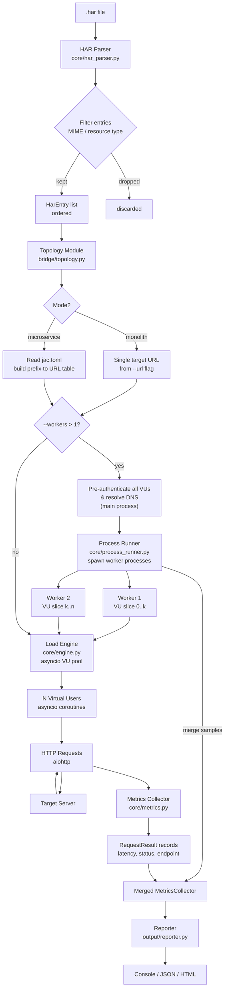
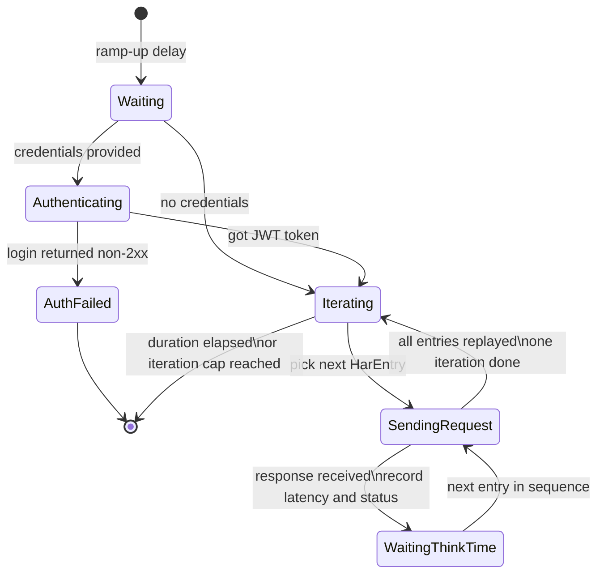
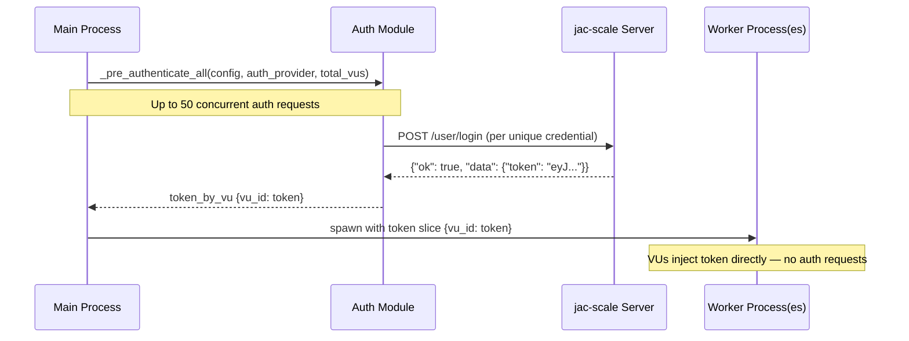
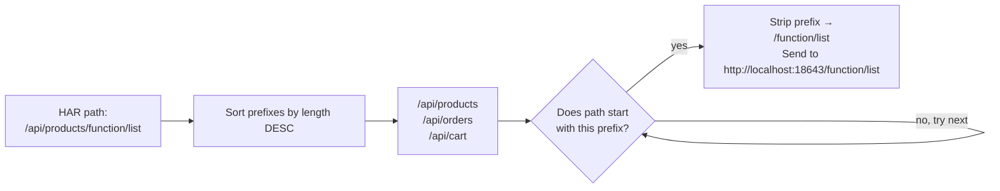

# jac-loadtest Architecture

## Table of Contents

1. [Overview](#overview)
2. [HAR 1.2 Primer](#har-12-primer)
3. [Module Map](#module-map)
4. [Config Resolution](#config-resolution)
5. [End-to-End Data Flow](#end-to-end-data-flow)
6. [Virtual User Lifecycle](#virtual-user-lifecycle)
7. [HAR Parser](#har-parser)
8. [Load Engine](#load-engine)
9. [Multi-Process Execution](#multi-process-execution)
10. [Exit Codes and Thresholds](#exit-codes-and-thresholds)
11. [Auth Module](#auth-module)
12. [Topology Module](#topology-module)
13. [Metrics Collector](#metrics-collector)
14. [Reporter](#reporter)
15. [CLI Reference](#cli-reference)
16. [Extension Points](#extension-points)
17. [Constraints and Known Limitations](#constraints-and-known-limitations)

---

## Overview

`jac-loadtest` is a HAR-based load testing CLI tool designed for [jac-scale](https://github.com/jaseci-labs/jaseci/tree/main/jac-scale) applications. Instead of writing test scripts in JavaScript (k6) or Python (Locust), users capture real browser traffic via Chrome DevTools, export it as a `.har` file, and feed it directly to this tool. The tool replays those requests under load and reports latency, error rates, and throughput.

### Design Philosophy

**Zero scripting.** The HAR file is the test script. The only configuration is load shape: how many virtual users, for how long, with what ramp-up.

**Core isolation.** The HAR parser, load engine, and metrics collector have zero knowledge of jac-scale internals. They work against any HTTP server. The jac-scale-specific logic (auth via `/user/login`, microservice topology from `jac.toml`) lives in a thin bridge layer on top of the core.

**`jac loadtest` from day one.** The standalone `jac-loadtest` PyPI package registers itself as a `jac` subcommand via `[project.entry-points."jac"]` — the same mechanism jac-scale uses. Installing `jac-loadtest` immediately makes `jac loadtest` available alongside `jac start`, `jac deploy`, etc. There is no separate `jac-loadtest` binary to learn. When the tool matures, the plan is to absorb it as `pip install jac-scale[loadtest]` — the code moves into jac-scale's `plugin.jac`, and the command name stays exactly the same. The architecture is designed so that migration is a file move, not a rewrite.

**Two testing modes.** Use **monolith mode** (`--mode monolith`, the default) to test end-to-end through the gateway — the right choice for production-realistic load testing that measures what users actually experience. Use **microservice mode** (`--mode microservice`) to route requests directly to individual service processes by path prefix, bypassing the gateway — useful locally or inside a cluster to isolate per-service latency and identify which service is the bottleneck. Microservice mode requires direct network access to service ports and is not usable against remote production deployments.

---

## HAR 1.2 Primer

A `.har` file is a JSON document produced by Chrome DevTools, Firefox, or any traffic recorder. It captures every HTTP transaction your browser made during a recording session.

### Structure

```
{
  "log": {
    "version": "1.2",
    "creator": { "name": "Chrome", "version": "..." },
    "pages": [ ... ],       ← page load events (we skip these)
    "entries": [ ... ]      ← HTTP transactions (this is what we care about)
  }
}
```

### Entry Object (one HTTP transaction)

```
entry
├── startedDateTime   ISO 8601 timestamp
├── time              total elapsed ms (sum of timings)
├── request
│   ├── method        GET / POST / PUT / DELETE / PATCH
│   ├── url           full absolute URL
│   ├── httpVersion   "HTTP/1.1" or "HTTP/2"
│   ├── headers       [ {name, value}, ... ]
│   ├── queryString   [ {name, value}, ... ]
│   ├── cookies       [ {name, value, domain, path, ...}, ... ]
│   ├── postData      { mimeType, text, params }   ← body (optional)
│   ├── headersSize   bytes (-1 if unknown)
│   └── bodySize      bytes (-1 if unknown)
├── response
│   ├── status        HTTP status code
│   ├── statusText    "OK", "Not Found", ...
│   ├── headers       [ {name, value}, ... ]
│   ├── content       { size, mimeType, text, encoding, compression }
│   ├── redirectURL   "" or redirect target
│   ├── headersSize   bytes
│   └── bodySize      bytes
├── cache             { beforeRequest, afterRequest }   ← we skip this
└── timings
    ├── blocked       ms waiting in browser queue     (-1 = N/A)
    ├── dns           ms for DNS resolution            (-1 = N/A)
    ├── connect       ms for TCP connect               (-1 = N/A)
    ├── ssl           ms for TLS handshake             (-1 = N/A)
    ├── send          ms to send request               (≥ 0, required)
    ├── wait          ms waiting for first byte (TTFB) (≥ 0, required)
    └── receive       ms to receive full response      (≥ 0, required)
```

### HAR 1.1 vs HAR 1.2

HAR 1.2 adds optional fields to 1.1. All additions are backward-compatible:

| Added in 1.2 | Where | Meaning |
|---|---|---|
| `ssl` | `timings` | TLS handshake duration |
| `comment` | most objects | Free-text annotation |
| `encoding` | `content` | e.g. `"base64"` for binary responses |
| `serverIPAddress` | `entry` | Resolved server IP |
| `connection` | `entry` | TCP connection ID |
| `secure` | cookie | HTTPS-only flag |

jac-loadtest targets HAR 1.2 but gracefully handles 1.1 files (all 1.2-only fields are optional).

### What We Parse vs Skip

| HAR field | We use it? | Reason |
|---|---|---|
| `entries[].request` | Yes — core replay data | |
| `entries[].timings.wait` | Yes — think-time source | TTFB = server processing time |
| `entries[].response.status` | Yes — logged for recording only | Not replayed; actual server decides |
| `entries[].response.content.mimeType` | Yes — filter logic | Skip image/*, font/*, text/css |
| `entries[].cache` | No | Not relevant for load replay |
| `pages` | No | Page-level metrics not needed |
| `creator` / `browser` | No | Metadata only |

### MIME Type Filter (default: skip static assets)

The following MIME types are skipped by default. These are static assets that add noise without testing server-side logic:

```
image/*         (image/png, image/jpeg, image/webp, image/svg+xml, ...)
font/*          (font/woff2, font/ttf, ...)
text/css
application/javascript / text/javascript   (JS bundles)
application/wasm
```

Kept by default:

```
application/json       ← API responses
text/html              ← server-rendered pages
application/xml
multipart/form-data    ← file uploads
application/x-www-form-urlencoded
```

Use `--include-static` to disable filtering and replay everything.

### Resource Type Filter (always active)

HAR files recorded from deployed apps include browser resource types that the tool
cannot correctly replay. These are filtered out unconditionally regardless of
`--include-static`:

| `_resourceType` | Reason skipped |
|---|---|
| `websocket` | Requires WebSocket protocol upgrade — tool only speaks HTTP |
| `eventsource` | Server-Sent Events stream — `resp.read()` would block forever |
| `document` | Full-page navigations, not API calls |
| `font` | Font files — Chrome sets `_resourceType="font"` but MIME is often `application/octet-stream` (not `font/*`), so the MIME filter alone misses them |
| `manifest` | Web app manifests |
| `texttrack` | Subtitle/caption tracks |
| `media` | Audio/video streams |

Additionally, any entry whose URL begins with `ws://` or `wss://` is skipped even if
`_resourceType` is absent or set to `other`.

A single warning is printed to stderr the first time an unsupported type is encountered:

```
Warning: HAR contains WebSocket, SSE, or non-API entries (websocket, eventsource,
document, etc.). These are skipped automatically.
```

### Cache-Busting URL Filter (always active)

Analytics and telemetry endpoints (PostHog, Mixpanel, etc.) embed a Unix timestamp in
the query string to prevent browser caching. When replayed, the stale timestamp causes
the server to reject the request with 400.

Entries are skipped when a query parameter whose name is in `{"_", "cb", "cachebust",
"cache_bust", "nocache", "bust"}` has a value that is a 10–13 digit number (Unix
timestamp in seconds or milliseconds):

```
/i/v0/e/?_=1779986528514   ← skipped  (13-digit ms timestamp)
/api/data?_=hello          ← kept     (not a timestamp)
/api/data?page=1           ← kept     (param name not a cache buster)
```

A single warning is printed to stderr the first time a cache-busting URL is encountered:

```
Warning: HAR contains URLs with cache-busting timestamp parameters
(e.g. ?_=<timestamp>). These entries are skipped — the stale timestamp
causes the server to reject the request.
```

### Missing Body Filter (always active)

Some browsers omit the request body from HAR recordings even when `Content-Length > 0` — typically when the DevTools recorder is attached after the page loads. Replaying such entries without a body would cause 422 Unprocessable Entity on every request.

An entry is skipped when:
- Method is `POST`, `PUT`, or `PATCH`
- `Content-Length` header is present and greater than 0
- `postData.text` is absent or empty

A single warning is printed to stderr on the first occurrence:

```
Warning: HAR contains POST/PUT/PATCH entries where the request body was not
captured (postData missing despite non-zero Content-Length). These entries
are skipped — replaying them without a body would cause 422 errors.
Re-record the HAR to capture the full request body.
```

---

## Module Map

```
jac_loadtest_cli/
├── plugin.jac          Registers `jac loadtest` via jaclang CommandRegistry (entry-points hook)
├── cli.jac             Argument wiring and run orchestration — called by plugin.jac
├── config.jac          LoadTestConfig — three-layer resolution: CLI flags → jac.toml → built-in defaults
│
├── core/               ← NO jac-scale knowledge. Works with any HTTP server.
│   ├── har_parser.jac     Parse HAR 1.2, filter entries, rewrite URLs
│   ├── engine.jac         asyncio VU pool, ramp-up, RPS cap, iteration control
│   ├── process_runner.jac Multi-process coordinator: splits VUs across worker processes, merges metrics
│   └── metrics.jac        Per-request recording, latency histograms, percentile calc
│
├── bridge/             ← jac-scale-aware layer. Thin adapters over core.
│   ├── auth.jac        Login via jac-scale /user/login, per-VU JWT injection
│   └── topology.jac    Build prefix→URL routing table from jac-scale ServiceRegistry
│
├── output/
│   └── reporter.jac        Console (Rich), JSON, HTML report rendering
└── templates/
    └── reporter_template.html  Self-contained HTML report template (string.Template syntax)
```

### Dependency Rules

```
plugin.jac
  └── imports from jaclang.cli.registry — registers `jac loadtest` subcommand

cli.jac
  └── uses config, core/*, bridge/*, output/

core/*               depends on: standard library + aiohttp only
core/process_runner  depends on: core/engine, core/metrics, core/har_parser, bridge/topology, bridge/auth
bridge/auth      depends on: core/har_parser, aiohttp
bridge/topology  depends on: jac_scale.config_loader, jac_scale.microservices.service_registry
output/*         depends on: core/metrics, rich
```

The `core/` modules must never import from `bridge/`. This is the hard boundary that keeps the tool independently testable against any HTTP server.

### Package Requirements

Defined in `jac.toml` — the single source of truth for package metadata and dependencies:

```toml
[project]
name = "jac-loadtest-cli"
requires-python = ">=3.12"    # hard floor set by jaclang and jac-scale

[dependencies]
jac-scale = ">=0.2.16"
aiohttp   = ">=3.9.0,<4.0.0"
rich      = ">=13.0.0"
requests  = ">=2.28.0"

[entrypoints.jac]
loadtest = "jac_loadtest_cli.plugin:loadtest"
```

`[entrypoints.jac]` is the same mechanism jac-scale uses to register its own commands. When `jac install jac-loadtest-cli` runs, jaclang discovers the `loadtest` entry point at startup and `jac loadtest` appears alongside all other `jac` subcommands.

### plugin.jac — Command Registration

`plugin.jac` is the entry-point hook that registers `jac loadtest` with jaclang's `CommandRegistry`.

Registration happens at module import time via a module-level decorator. jaclang imports the module when it loads the entry-point.

```jac
import from jaclang.cli.registry { get_registry }
import from jaclang.cli.command { Arg, ArgKind }

glob registry = get_registry();

@registry.command(
    name="loadtest",
    help="HAR-based load testing for jac-scale apps",
    args=[
        Arg.create("har_file", kind=ArgKind.POSITIONAL, help="Path to .har file"),
        Arg.create("url",      typ=str, default=None, short="", help="Target base URL"),
        Arg.create("vus",      typ=int, default=None, short="", help="Number of virtual users"),
        Arg.create("duration", typ=str, default=None, short="", help="Test duration (e.g. 30s, 2m)"),
        # ... all toml-resolvable flags use default=None so resolve() can detect "not passed"
        # ... CLI-only flags (url, username, password, etc.) also use default=None
    ],
    group="testing",
    source="jac-loadtest",
)
def loadtest(**kwargs: object) {
    import from .cli { run }
    run(types.SimpleNamespace(**kwargs));
}
```

**API notes:**
- Use `Arg.create()`, not `Arg(...)`. The factory method signature is `Arg.create(name, kind=..., typ=..., default=..., help=..., short=...)`.
- `typ=bool` produces a boolean flag (no `ArgKind.FLAG` needed — the registry handles it).
- `Arg.create()` auto-generates a short flag from the first letter of the name. Pass `short=""` to disable.
- The handler must use `**kwargs` signature — jaclang's `run_handler` calls `spec.handler(**filtered_args)`. Use `types.SimpleNamespace(**kwargs)` to bridge into `from_args()`.

This is the only file in `jac_loadtest_cli/` that imports from `jaclang.cli`. All test logic stays in `cli.jac`, `core/`, `bridge/`, and `output/`.

---

## Config Resolution

`config.py` resolves all settings through a three-layer priority chain. CLI flags always
win; `jac.toml` provides project-level defaults; built-in defaults are the fallback when
neither is provided. This means a team can commit shared test settings in `jac.toml`
and override them per-run via CLI flags without changing the file.

### Fallback Chain

```
Priority 1 — CLI flag          (e.g. --vus 50)           ← always wins
Priority 2 — jac.toml          ([plugins.scale.loadtest]) ← project default
Priority 3 — Built-in default  (hardcoded in config.py)   ← always present
```

### How It Works

`config.jac` reads `[plugins.scale.loadtest]` from `jac.toml` using jac-scale's native
config API, then applies CLI values on top via a `_resolve()` helper:

```jac
def _load_toml_defaults() -> dict[str, object] {
    try {
        from pathlib import Path;
        from jac_scale.config_loader import get_scale_config, reset_scale_config;
        reset_scale_config();
        scale_config = get_scale_config(project_dir=Path.cwd());
        return scale_config.get_section("loadtest");
    } except Exception {
        return {};   # jac.toml absent or section missing — fall through to built-in defaults
    }
}

def from_args(args: object) -> LoadTestConfig {
    toml = _load_toml_defaults();

    def _resolve(name: str, args: object, toml: dict[str, object]) -> object {
        cli_val = getattr(args, name, None);
        if cli_val is not None {   # user explicitly passed this flag
            return cli_val;
        }
        if name in toml {          # jac.toml has a value
            return toml[name];
        }
        return BUILT_IN_DEFAULTS.get(name);   # last resort
    }

    return LoadTestConfig(
        vus      = _resolve("vus", args, toml),
        duration = _resolve("duration", args, toml),
        timeout  = _resolve("timeout", args, toml),
        # ... same pattern for all toml-resolvable fields
    );
}
```

`reset_scale_config()` is called before each lookup to ensure the singleton is always
initialized from `Path.cwd()` — the directory the user ran `jac loadtest` from. Without
this, a prior jac-scale plugin initialization could set the singleton to a different path.

Plugin args use `default=None` for all toml-resolvable flags so `resolve()` can detect
"user did not pass this flag" as `getattr(...) is None`. Built-in defaults live only in
`BUILT_IN_DEFAULTS`, not in the argparse layer.

If `jac.toml` does not exist, `_load_toml_defaults()` returns `{}` — the tool works in
any directory with no configuration file required.

### jac.toml Example

```toml
[plugins.scale.loadtest]
# Load shape
vus                   = 20
workers               = 4            # worker processes (default: CPU core count)
duration              = "60s"
ramp_up               = "10s"
timeout               = "30s"

# Traffic
mode                  = "monolith"
think_time            = "none"
rps                   = 0            # 0 = unlimited
include_static        = false

# Auth
login_path            = "/user/login"

# CI thresholds (team SLOs)
fail_on_error_rate    = 1.0          # percent
fail_on_p95           = 500          # ms
fail_on_p99           = 1000         # ms
threshold_start_delay = "30s"

# Output
report_format         = "console"
max_samples           = 1000000
```

### What stays CLI-only

Some settings are intentionally excluded from `jac.toml` — they change per run,
per environment, or contain sensitive data that must not be version-controlled:

| Flag | Reason |
|------|--------|
| `har_file` | Positional arg, different every run |
| `--url` | Changes between dev / staging / prod |
| `--credentials-file` | Security-sensitive — never commit |
| `--username` / `--password` | Security-sensitive |
| `--services-map` | Environment-specific URL overrides |
| `--report-out` | Output path changes per run |

---

## End-to-End Data Flow



---

## Virtual User Lifecycle

Each virtual user (VU) is an `asyncio` coroutine. All VUs run concurrently within a single event loop.



### Ramp-up

If `--ramp-up 10s --vus 50` is set, VU startup is staggered:

```
start_delay = ramp_up_seconds / num_vus

VU 1  starts at t=0.0s
VU 2  starts at t=0.2s
VU 3  starts at t=0.4s
...
VU 50 starts at t=9.8s
```

This avoids a thundering herd at test start and allows the server to warm up gradually, matching real-world traffic ramp patterns.

### RPS Cap (Token Bucket) — Planned, Phase 4

`--rps N` is accepted and stored in `LoadTestConfig.rps` but the enforcement mechanism does not yet exist. The plan is a shared `asyncio.Semaphore` with periodic token refill — all VUs compete for tokens before sending each request, refilled at `N tokens/second`. This will enforce a global RPS ceiling regardless of how many VUs are running. **Currently the flag has no effect.**

---

## HAR Parser

**File:** `core/har_parser.py`

### Inputs

- Path to `.har` file
- `base_url`: the recorded origin to replace (extracted automatically from the first HAR entry)
- `target_url`: the actual test target (from `--url` flag)
- `include_static`: bool — whether to skip the MIME type filter
- `login_path`: path to detect as the login entry (default `/user/login`)

### Output

An ordered list of `HarEntry` dataclass instances:

```python
@dataclass
class HarEntry:
    method: str                  # "GET", "POST", etc.
    url: str                     # rewritten URL (target_url + original path + query)
    headers: dict[str, str]      # sanitized request headers
    body: str | None             # postData.text or None
    body_mime: str | None        # postData.mimeType
    think_time_ms: float         # timings.wait from HAR recording
    is_login: bool               # True if path matches login_path
    original_url: str            # original recorded URL (for debugging/logging)
    occurrence: int = 0          # 1-based index of this path in the HAR (e.g. 2nd call to /walker/search)
    total_occurrences: int = 0   # total times this path appears in the HAR
```

### URL Rewriting

The recorded HAR contains absolute URLs pointing to wherever the recording was made. We replace only the origin (scheme + host + port), preserving path and query string exactly:

```
HAR URL:    http://localhost:8000/walker/search?q=hello
target_url: http://staging.myapp.com:9000
Result:     http://staging.myapp.com:9000/walker/search?q=hello
```

### Security Warning

HAR files recorded in Chrome contain the original session's credentials — Authorization
headers (JWT tokens, API keys) and Cookie headers — from the moment of recording.

At startup, the parser scans all HAR request headers. If any entry contains an
`Authorization` or `Cookie` header with a non-empty value, a warning is printed to stderr:

```
Warning: HAR file contains Authorization/Cookie headers from the recording session.
These headers are stripped before replay, but the file itself contains sensitive data.
Do not commit this HAR file to version control.
```

This is a warning only — the tool still runs. The sensitive headers are stripped
during Header Sanitization below and never sent to the target server.

### Header Sanitization

These headers are stripped before replay — they are session-specific and are set fresh at runtime:

```
Authorization   replaced by auth module with fresh JWT
Cookie          managed by per-VU aiohttp cookie jar
Host            set by aiohttp based on target URL
Content-Length  recalculated by aiohttp from body
```

Additionally, **HTTP/2 pseudo-headers** are stripped unconditionally. Chrome DevTools
records HTTP/2 pseudo-headers (`:authority`, `:method`, `:path`, `:scheme`) as regular
entries in the HAR `headers` array. These are protocol-level framing fields, not real
HTTP headers — sending them as literal headers causes servers to return 400 Bad Request.
Any header whose name begins with `:` is removed:

```
:authority  → stripped  (equivalent to Host, already stripped)
:method     → stripped  (the HTTP method is taken from request.method instead)
:path       → stripped  (the path is taken from the URL)
:scheme     → stripped  (the scheme is taken from the target URL)
```

This is the reason HAR files from deployed HTTPS apps (which use HTTP/2) previously
caused 400 errors on every request, while local HTTP/1.1 dev servers were unaffected.

### Think Time

`timings.wait` in the HAR represents the server's response time as observed by the browser (Time To First Byte). It is the most meaningful inter-request pacing value because it reflects realistic user wait time.

| Mode | Behaviour |
|---|---|
| `none` (default) | No delay between requests — maximum stress |
| `real` | Wait exactly `timings.wait` ms between each request |
| `scaled` | Wait `timings.wait * scale_factor` ms (e.g. `--think-time-scale 0.5`) |

---

## Load Engine

**File:** `core/engine.py`

### Concurrency Model

```python
async def run_all_vus(
    entries, config, metrics,
    topology=None, auth_provider=None,
    vu_id_offset=0,           # starting VU ID for this worker's slice
    pre_authed_tokens=None,   # {vu_id: token} from main process (multi-process path)
    pre_resolved_hosts=None,  # {hostname: ip} pre-resolved by main process
):
    tasks = []
    for i in range(config.vus):
        delay = (i / config.vus) * ramp_up_seconds if config.vus > 1 else 0.0
        task = asyncio.create_task(
            _run_vu(vu_id=vu_id_offset + i, delay=delay, ...)
        )
        tasks.append(task)

    await asyncio.gather(*tasks)
    # Note: StatsSnapshots are NOT generated during the run.
    # cli.py calls metrics.generate_timeseries(t_start) after the run completes,
    # which bins all collected RequestResult samples into 10-second buckets.
```

Each VU is an independent coroutine. There is no shared mutable state between VUs — each has its own:
- `aiohttp.ClientSession` with a `TCPConnector` (owns cookie jar, connection pool, and timeout config)
- JWT token (injected from `pre_authed_tokens` on the multi-process path, or fetched during auth phase on the single-process path)
- Iteration counter and request sequence position

### Request Timeout

Each VU's `ClientSession` is created with a configurable timeout. Without this, a VU waiting
on a hung server blocks indefinitely and the test never ends.

```python
timeout = aiohttp.ClientTimeout(total=config.timeout_seconds)
session = aiohttp.ClientSession(timeout=timeout)
```

Controlled by `--timeout 30s` (default: 30 seconds). Timed-out requests are recorded as
`error_type="TIMEOUT"` with `status=0` and `latency_ms` equal to the timeout value.

### Request Execution

```python
async def _send_request(session, entry, vu_id, config, loop, token, topology):
    headers = dict(entry.headers)
    if token:
        headers["Authorization"] = f"Bearer {token}"

    # topology.resolve() returns (request_url, service_name); raises ValueError if no route
    if topology is not None:
        request_url, service_name = topology.resolve(entry.url)
    else:
        request_url, service_name = entry.url, "monolith"

    t0 = loop.time()
    try:
        async with session.request(
            entry.method, request_url, headers=headers,
            data=entry.body, allow_redirects=False,
        ) as resp:
            body = await resp.read()
            return RequestResult(
                endpoint=normalize_path(entry.url), service=service_name,
                status=resp.status, latency_ms=(loop.time() - t0) * 1000,
                bytes_received=len(body), timestamp=t0, vu_id=vu_id,
                error_type=None, occurrence=entry.occurrence,
                total_occurrences=entry.total_occurrences,
            )
    except asyncio.TimeoutError:
        return RequestResult(..., error_type="TIMEOUT")
    except aiohttp.ClientConnectorDNSError:
        return RequestResult(..., error_type="DNS_ERROR")
    except aiohttp.ClientSSLError:
        return RequestResult(..., error_type="SSL_ERROR")
    except aiohttp.ClientConnectorError:
        return RequestResult(..., error_type="CONNECTION_REFUSED")
    except aiohttp.ServerDisconnectedError:
        return RequestResult(..., error_type="SERVER_DISCONNECTED")
    except aiohttp.ClientOSError:
        return RequestResult(..., error_type="CONNECTION_RESET")
    except Exception as e:
        return RequestResult(..., error_type=str(e).upper() or type(e).__name__.upper())
```

### Duration vs Iteration Control

`--duration` is accepted and stored in config, but does **not** control when VUs stop. VUs stop when `--iterations` is reached or a stop signal is received.

The reporters (`render_console`, `render_json`, `render_html`) accept an `actual_duration_s` parameter. When provided (the normal CLI path, where `cli.py` measures wall-clock elapsed time), the actual value is used. `config.duration` is only used as a fallback when `actual_duration_s` is `None` — for example, when calling the render functions directly in tests without a real run.

| Mode | Config | Behaviour |
|---|---|---|
| Iterations | `--iterations N` | Each VU stops after completing N full HAR replays (default: 1) |
| Stop signal | Ctrl+C | First SIGINT sets `stop_requested`; VUs finish current iteration |

---

## Multi-Process Execution

**File:** `core/process_runner.py`

When `--workers N` (N > 1), `cli.py` delegates to `run_multiprocess()` instead of calling `asyncio.run(run_all_vus(...))` directly. This bypasses Python's GIL and lets each worker use a full CPU core for its event loop.

### Worker Slicing

VUs are distributed as evenly as possible across workers. `_compute_slices()` returns `[(vu_id_offset, worker_vu_count), ...]`:

```
--vus 10 --workers 3  →  [(0, 4), (4, 3), (7, 3)]
```

Each worker receives its slice's `vu_id_offset` and runs a `LoadTestConfig` with `vus = worker_vu_count`. Worker count is capped at `config.vus` so no idle processes are ever spawned.

### Spawn Start Method

`multiprocessing.get_context("spawn")` is used instead of `fork`. This ensures each worker gets a clean interpreter with no inherited asyncio event loop — `fork` + asyncio leads to deadlocks.

### Pre-Authentication

With `fork` ruled out, workers cannot share objects from the parent process. To avoid an auth burst (N workers × M VUs all hitting `/user/login` simultaneously), `_pre_authenticate_all()` runs in the main process before any worker spawns:

1. All unique credential indices are authenticated concurrently (up to 50 in parallel).
2. A `token_by_vu` dict is built mapping each VU ID to its JWT.
3. Workers receive only their slice of this dict and never touch the auth endpoint.

### Pre-Resolved DNS

Similarly, `_resolve_hosts()` resolves the target hostname once in the main process. Each worker receives the `{hostname: ip}` mapping and injects it into its `aiohttp.TCPConnector` via `_PreResolvedResolver` — workers skip DNS entirely, eliminating the thundering-herd DNS burst on startup.

### Result Collection

Each worker sends exactly one `("ok", [RequestResult, ...]) | ("error", traceback_str)` tuple to a shared `multiprocessing.Queue`. The main process collects one result per worker, joins all processes, then merges all sample lists into a single `MetricsCollector`.

If any worker reports an error, the first error traceback is re-raised as `RuntimeError` in the main process. Workers still alive after a `KeyboardInterrupt` are terminated in a `finally` block.

---

### Graceful Shutdown (Two-Signal Model)

Adopted from k6. A single Ctrl+C does not kill the process immediately — it allows
in-flight work to complete and generates a partial report from data collected so far.

| Signal | Behaviour |
|--------|-----------|
| First SIGINT (Ctrl+C) | Set shared `stop_requested: asyncio.Event`. VUs finish their current iteration then exit. Report is generated from all data collected up to this point. |
| Second SIGINT | Immediate abort. No report generated. |

```python
stop_requested = asyncio.Event()

async def run_vu(vu_id, ...):
    while not stop_requested.is_set():
        if duration_elapsed or iteration_cap_reached:
            break
        await replay_one_iteration(...)
```

The signal handler sets `stop_requested` on first SIGINT, then registers a hard-exit
handler for the second. This ensures a 10-minute test interrupted at minute 9 still
produces a useful partial report.

---

## Exit Codes and Thresholds

### Exit Codes

| Code | Meaning |
|------|---------|
| `0` | Test completed normally and all thresholds passed |
| `1` | One or more thresholds failed |
| `2` | Tool or config error (malformed HAR, connection refused at start, invalid flags) |

This allows CI pipelines to gate deployments:

```bash
jac loadtest recording.har --url http://staging:8000 --vus 20 \
  --fail-on-error-rate 1 --fail-on-p95 500
echo $?   # 0 = passed, 1 = threshold failed, 2 = tool error
```

### Threshold Flags

| Flag | Description |
|------|-------------|
| `--fail-on-error-rate N` | Exit 1 if error rate exceeds N percent (e.g. `--fail-on-error-rate 1`) |
| `--fail-on-p95 N` | Exit 1 if p95 latency exceeds N milliseconds |
| `--fail-on-p99 N` | Exit 1 if p99 latency exceeds N milliseconds |
| `--abort-on-fail` | Stop test immediately when any threshold is breached (k6 `abortOnFail`) |
| `--threshold-start-delay Ns` | Do not evaluate thresholds until N seconds into the run (default `0s`) |

### Threshold Start Delay

The server is cold at test start — JIT not warmed, caches empty, connection pools not
established. Early latency spikes would falsely fail a `--fail-on-p95` threshold.

`--threshold-start-delay 30s` defers pass/fail evaluation until 30 seconds into the run.
Metrics are still **collected** from t=0 and appear in the report — only the threshold
check is delayed. This is the same as k6's `delayAbortEval` pattern.

```
t=0s  ─── metrics collected, thresholds NOT evaluated
t=30s ─── threshold evaluation begins
t=60s ─── test ends, final threshold check, exit code set
```

---

## Auth Module

**File:** `bridge/auth.py`

This module is jac-scale-aware. It knows the `/user/login` endpoint request and response shape.

### Login Flow

Before the test starts, all VU credentials are authenticated in a single controlled burst — either in the main process (multi-process path) or inside `run_all_vus` (single-process path). Workers receive tokens directly and never touch the auth endpoint.



### Credentials Assignment

If `--credentials-file creds.csv` is provided:
- Row `i` is assigned to VU `i`
- If there are fewer rows than VUs, credentials wrap around: VU N gets row `N % num_rows`

If only `--username` / `--password` flags are given:
- All VUs share the same login credentials — each gets a separate fresh token from the server

If no credentials are provided:
- No login step — requests are sent without `Authorization` header
- Suitable for testing `:pub` walkers that require no authentication

### jac-scale Login Request Shape

```json
POST /user/login
{
  "identity": {
    "type": "username",
    "value": "myuser"
  },
  "credential": {
    "type": "password",
    "password": "secret"
  }
}
```

Response on success (HTTP 200):

```json
{
  "ok": true,
  "data": {
    "token": "eyJ...",
    "user_id": "550e8400-...",
    "role": "user"
  }
}
```

`data.token` is extracted and injected as `Authorization: Bearer <token>` on all subsequent requests for that VU.

### Cookie Jar

Each VU's `aiohttp.ClientSession` maintains its own `aiohttp.CookieJar`. Cookies set during login are automatically included in subsequent requests. This mirrors real browser session behaviour.

### CSRF (Optional, `--csrf` flag)

jac-scale itself does not use CSRF tokens — it uses JWT. CSRF only matters if a reverse proxy adds CSRF protection in front of the jac-scale server. When `--csrf` is enabled:

1. After login, scan response `Set-Cookie` headers for a cookie named `csrftoken` or `_csrf`
2. Extract its value
3. Inject `X-CSRFToken: <value>` header on all subsequent non-GET requests for that VU
4. Rotate the value if a new token arrives in a subsequent response

---

## Topology Module

**File:** `bridge/topology.py`

Translates a HAR entry's path into the correct target server URL. The behaviour differs between the two deployment modes.

### Monolith Mode

All requests route to the single `--url` value. Only the origin is replaced; path and query string are preserved from the HAR entry.

```
entry.url = "http://recorded-host:8000/walker/search?q=test"
--url      = "http://staging.app.com:9000"
result     = "http://staging.app.com:9000/walker/search?q=test"
```

### Microservice Mode

In microservice mode, jac-scale runs a **gateway** that routes requests to individual services by URL path prefix (implemented in `jac-scale/jac_scale/microservices/service_registry.jac` as `ServiceRegistry.match_route()`). Our tool replicates this routing so it can send requests directly to individual services, bypassing the gateway. This lets us measure per-service latency independently.

#### Reading jac.toml

The routing table is built from the project's `jac.toml`. Routes are declared as a flat
`[plugins.scale.microservices.routes]` table mapping module name → gateway prefix:

```toml
[plugins.scale.microservices]
enabled = true

[plugins.scale.microservices.routes]
order_service     = "/walker/order"
inventory_service = "/walker/inventory"
```

Service URLs are **not** stored in `jac.toml`. When jac-scale starts services locally it sets
`JAC_SV_<MODULE>_URL` environment variables (e.g. `JAC_SV_ORDER_SERVICE_URL=http://localhost:18001`).
The topology module reads these env vars to build the routing table:

```python
{
    "/walker/order":     "http://localhost:18001",   # from JAC_SV_ORDER_SERVICE_URL
    "/walker/inventory": "http://localhost:18002",   # from JAC_SV_INVENTORY_SERVICE_URL
}
```

#### Longest-Prefix Routing and Prefix Stripping

This mirrors jac-scale's `ServiceRegistry.match_route()` algorithm exactly. Given a request path, prefixes are sorted by length descending — the longest matching prefix wins. Once a match is found, the prefix is **stripped** from the path before the request is sent to the service — exactly as the jac-scale gateway strips it when forwarding:



Prefix stripping is essential: the individual service only knows about paths **after** the gateway prefix (e.g. `/function/list_products`), not the full gateway path (`/api/products/function/list_products`). Without stripping, the service returns 405 Method Not Allowed because the path does not match any of its routes.

The `endpoint` label stored in metrics always uses the **original HAR path** (before stripping), so the report shows the user-facing URL the browser recorded — not the internal service path.

#### Service URL Resolution

For remote or CI deployments where no `jac.toml` or `JAC_SV_*_URL` env vars are present, use `--services-map` to supply URLs explicitly:

```bash
jac loadtest recording.har --mode microservice \
  --services-map '{"order_service": "http://order.internal:8001"}'
```

`--services-map` bypasses `jac.toml` entirely — use it when there is no `jac.toml` or when you want to override all service URLs at once.

#### Fallback

If a request path does not match any service prefix, it is routed to `--url` (the gateway). If `--url` is also not set, the request is skipped and a warning is emitted.

---

## Metrics Collector

**File:** `core/metrics.py`

### Per-Request Record

```python
@dataclass
class RequestResult:
    endpoint: str           # normalized: "POST /walker/search"
    service: str            # service name or "monolith"
    status: int             # HTTP status code; 0 if network-level error
    latency_ms: float       # request dispatch to response received
    bytes_received: int     # response body bytes
    timestamp: float        # unix timestamp of request start
    vu_id: int              # which VU sent this
    error_type: str | None  # None = HTTP response received (any status)
                            # "TIMEOUT", "CONNECTION_REFUSED", "DNS_ERROR", "SSL_ERROR",
                            # "SERVER_DISCONNECTED", "CONNECTION_RESET", or exception class name
    occurrence: int         # 1-based index of this path in the HAR (e.g. 2nd of 3 calls)
    total_occurrences: int  # total times this path appears in the HAR
```

When `error_type` is set, `status` is always `0`. This distinguishes network-level
failures (no response at all) from HTTP-level errors (server responded with 4xx/5xx).

### Three-Layer Metrics Storage

Metrics are stored in three independent layers to handle long runs correctly:

```
Layer 1 — total_count: int
  Incremented on every request, never dropped.
  Used for RPS: total_count / elapsed_seconds.

Layer 2 — deque(maxlen=--max-samples) of RequestResult
  Bounded raw samples for percentile calculation.
  Oldest results are dropped when the deque is full (long runs only).
  --max-samples default: 1,000,000.

Layer 3 — list[StatsSnapshot] (one entry per 10 seconds)
  Aggregated stats at each interval: p50, p95, p99, rps, error_rate, total_requests.
  Generated POST-RUN by MetricsCollector.generate_timeseries(t_start), called in cli.py.
  Bins all Layer 2 samples into 10-second buckets — NOT streamed during the run.
  Used for the RPS-over-time and latency-over-time charts in HTML/JSON reports.
```

This design ensures RPS is always accurate (Layer 1 never drops), percentile
calculation uses recent samples (Layer 2 bounded), and time-series charts are
available for the full run duration (Layer 3 complete history).

### Aggregation

After the run, stats are computed per endpoint (and per service in microservice mode):

```python
@dataclass
class EndpointStats:
    endpoint: str
    service: str
    total_requests: int
    success_count: int           # 2xx responses
    error_count: int             # non-2xx + network errors
    success_rate_pct: float
    min_ms: float
    max_ms: float
    mean_ms: float
    p50_ms: float                # median
    p95_ms: float
    p99_ms: float
    error_breakdown: dict[str, int]  # {"500": 3, "TIMEOUT": 2, "CONNECTION_REFUSED": 1}
```

Global RPS is derived separately from `MetricsCollector.global_rps(duration_seconds)` (Layer 1 `total_count / elapsed`), not stored per endpoint.

Note: `error_breakdown` keys are strings — either HTTP status codes (`"500"`, `"404"`)
or network error type names: `"TIMEOUT"`, `"CONNECTION_REFUSED"`, `"DNS_ERROR"`, `"SSL_ERROR"`, `"SERVER_DISCONNECTED"`, `"CONNECTION_RESET"`, or the exception class name for any other error.

### Endpoint Normalization

`normalize_path()` in `core/metrics.py` is applied to every URL before storing
the `endpoint` field. It strips the scheme and host, returning the path only, and
replaces UUID and integer path segments with `{id}`:

```
http://localhost:8000/walker/user/123        → /walker/user/{id}
http://recorded:8000/walker/order/abc-def-0  → /walker/order/{id}
http://svc:18001/walker/search               → /walker/search        (unchanged)
```

Stripping the origin ensures the endpoint label is consistent between monolith mode
(where `entry.url` is rewritten to the target URL) and microservice mode (where
`entry.url` retains the original recorded URL with a different host).

Detection rules:
- Pure integer segment: `^\d+$`
- UUID segment: `^[0-9a-f-]{32,36}$` (with or without hyphens)

Without normalization, `/walker/user/123` and `/walker/user/456` appear as two
separate rows in the report — useless at scale.

### Percentile Calculation

Uses the nearest-rank method on sorted latency values. No external dependencies:

```python
def percentile(latencies: list[float], p: float) -> float:
    if not latencies:
        return 0.0
    sorted_l = sorted(latencies)
    idx = int(math.ceil(p / 100.0 * len(sorted_l))) - 1
    return sorted_l[max(0, idx)]
```

---

## Reporter

**File:** `output/reporter.py`

### stdout vs stderr

All human-readable output goes to **stderr**. Machine-readable output goes to **stdout**
(or to a file when `--report-out` is set). This separation is critical for CI pipelines
that parse stdout — mixing progress output into stdout breaks `jq` and similar tools.

| Output type | Stream |
|-------------|--------|
| Live progress bar | stderr |
| `--debug` per-request lines | stderr |
| Console summary table | stderr |
| Warning messages (HAR security, missing services) | stderr |
| `--report-format json` content | stdout (or file if `--report-out` set) |
| `--report-format html` content | file only — never written to stdout |

### Console Output (default)

Uses the `rich` library for formatted terminal output.

**Live progress during run:**

```
Running load test ━━━━━━━━━━━━━━━━━━━━ 45%  0:00:16 remaining  VUs: 10  RPS: 47.3
```

**Summary table after run:**

```
┌─────────────────────────────┬───────┬──────┬──────┬──────┬──────┬───────┬───────┐
│ Endpoint                    │ Reqs  │  OK% │  p50 │  p95 │  p99 │  RPS  │ Errs  │
├─────────────────────────────┼───────┼──────┼──────┼──────┼──────┼───────┼───────┤
│ POST /walker/search         │  2341 │ 99.8 │  45ms│ 210ms│ 890ms│  78.0 │   5   │
│ POST /walker/get_users      │  1170 │ 100  │  12ms│  38ms│  95ms│  39.0 │   0   │
│ POST /user/login            │    10 │ 100  │  88ms│  92ms│  94ms│   0.3 │   0   │
├─────────────────────────────┼───────┼──────┼──────┼──────┼──────┼───────┼───────┤
│ TOTAL                       │  3521 │ 99.9 │  28ms│ 145ms│ 712ms│ 117.3 │   5   │
└─────────────────────────────┴───────┴──────┴──────┴──────┴──────┴───────┴───────┘

Duration: 30.0s   VUs: 10   Ramp-up: 5s   Mode: monolith
```

In microservice mode, an additional table groups stats by service name.

### JSON Output (`--report-format json`)

Machine-readable format for CI pipelines. Written to stdout by default; written to a file when `--report-out` is set (nothing printed to stdout in that case).

```json
{
  "meta": {
    "har_file": "recording.har",
    "url": "http://localhost:8000",
    "mode": "monolith",
    "vus": 10,
    "workers": 1,
    "duration": "30s",
    "ramp_up": "0s",
    "actual_duration_s": 30.123,
    "total_rps": 117.3
  },
  "endpoints": [
    {
      "endpoint": "POST /walker/search",
      "service": "monolith",
      "total_requests": 2341,
      "success_count": 2336,
      "error_count": 5,
      "success_rate_pct": 99.8,
      "min_ms": 12.1,
      "max_ms": 890.4,
      "mean_ms": 46.2,
      "p50_ms": 45.0,
      "p95_ms": 210.0,
      "p99_ms": 890.0,
      "error_breakdown": { "500": 5 }
    }
  ],
  "summary": {
    "total_requests": 3521,
    "success_count": 3516,
    "error_count": 5,
    "success_rate_pct": 99.9,
    "p50_ms": 28.0,
    "p95_ms": 145.0,
    "p99_ms": 712.0,
    "total_rps": 117.3
  },
  "timeseries": [
    {
      "timestamp": 10.0,
      "total_requests": 1200,
      "p50_ms": 44.0,
      "p95_ms": 190.0,
      "p99_ms": 750.0,
      "rps": 120.0,
      "error_rate_pct": 0.1
    }
  ]
}
```

The `timeseries` array contains one entry per 10-second interval, generated post-run by `MetricsCollector.generate_timeseries()`. It is empty when the test run is shorter than 10 seconds (no complete bucket to bin).

### HTML Output (`--report-format html`)

Single-file HTML report rendered from `jac_loadtest_cli/templates/reporter_template.html` using Python's `string.Template`. All data is inlined as JavaScript variables. Chart.js is loaded from CDN (`cdn.jsdelivr.net`) — **internet access is required when opening the report in a browser**.

Requires `--report-out <path>` — exits with code 2 if omitted. Prints `HTML report written to <path>` to stderr on success.

Contains:

- Six summary cards: Total Requests, Success Rate, p50/p95/p99 Latency, Avg RPS
- Latency-over-time line chart (p50/p95/p99 lines) — shows "No time-series data collected" when run was under 10s
- RPS-over-time line chart — same condition
- Per-endpoint latency bar chart (p50/p95/p99 grouped bars)
- Full endpoint stats table with TOTAL footer row
- Meta footer: Workers, Ramp-up, Timeout, URL

In microservice mode, an extra "Service" column appears in the endpoint table.

---

## CLI Reference

### Command

```bash
jac loadtest <har_file> [options]
```

The `jac loadtest` subcommand is available after `jac install jac-loadtest-cli` — no separate binary, no PATH changes. It is registered via `[entrypoints.jac]` in `jac.toml` and appears alongside all other `jac` subcommands (`jac start`, `jac deploy`, etc.).

### All Flags

CLI flags always override `jac.toml`. The `jac.toml?` column marks which flags can also
be set under `[plugins.scale.loadtest]` in your project's `jac.toml`.

| Flag | Default | jac.toml? | Description |
|---|---|---|---|
| `har_file` | required | No | Path to `.har` file |
| `--url` / `-u` | required in monolith mode | No | Target base URL — changes per environment |
| `--mode` | `monolith` | Yes | `monolith` or `microservice` |
| `--vus` / `-v` | `1` | Yes | Number of virtual users |
| `--workers` | CPU count | Yes | Number of worker processes. Each worker runs its own asyncio event loop on a separate OS thread. Capped at `--vus` so no idle processes are spawned. |
| `--duration` / `-d` | `30s` | Yes | Fallback display duration in reports when actual elapsed time is unavailable. Does not stop VUs — use `--iterations` to cap run length. |
| `--iterations` | `1` | Yes | Stop each VU after N full HAR replays. The actual elapsed wall-clock time is reported regardless of this value. |
| `--ramp-up` | `0s` | Yes | Time to ramp up to full VU count |
| `--timeout` | `30s` | Yes | Per-request timeout. Exceeded requests recorded as TIMEOUT error. |
| `--think-time` | `none` | Yes | `none`, `real`, or `scaled` |
| `--think-time-scale` | `1.0` | Yes | Multiplier used when `--think-time scaled` |
| `--username` | — | No | Security-sensitive — CLI only |
| `--password` | — | No | Security-sensitive — CLI only |
| `--credentials-file` | — | No | Security-sensitive — CLI only |
| `--login-path` | `/user/login` | Yes | URL path to detect as the login entry |
| `--include-static` | false | Yes | Do not skip image/font/CSS entries |
| `--rps` | unlimited | Yes | Global requests-per-second cap |
| `--max-samples` | `1000000` | Yes | Max raw request records to keep in memory (Layer 2) |
| `--services-map` | — | No | Environment-specific URL overrides — CLI only |
| `--csrf` | false | Yes | Enable CSRF token detection and injection |
| `--fail-on-error-rate` | — | Yes | Exit 1 if error rate exceeds N percent (e.g. `1.0`) |
| `--fail-on-p95` | — | Yes | Exit 1 if p95 latency exceeds N milliseconds |
| `--fail-on-p99` | — | Yes | Exit 1 if p99 latency exceeds N milliseconds |
| `--abort-on-fail` | false | Yes | Stop test immediately when any threshold is breached |
| `--threshold-start-delay` | `0s` | Yes | Delay threshold evaluation N seconds from test start |
| `--report-format` | `console` | Yes | `console`, `json`, or `html` |
| `--report-out` | — | No | Output path changes per run — CLI only |
| `--debug` | false | No | Print each request and response status to stderr during run |

### Examples

```bash
# Minimal: 1 VU, 30 seconds
jac loadtest recording.har --url http://localhost:8000

# 50 VUs with 10s ramp-up, 60s duration
jac loadtest recording.har --url http://localhost:8000 \
  --vus 50 --ramp-up 10s --duration 60s

# Authenticated test with per-VU credentials
jac loadtest recording.har --url http://localhost:8000 \
  --vus 20 --duration 30s --credentials-file creds.csv

# Realistic pacing using recorded think times
jac loadtest recording.har --url http://localhost:8000 \
  --vus 10 --duration 60s --think-time real

# Microservice mode — reads jac.toml from current directory
jac loadtest recording.har --mode microservice \
  --vus 30 --duration 60s

# Microservice mode with explicit remote service URLs
jac loadtest recording.har --mode microservice \
  --services-map '{"order_service":"http://order.svc:8001","inventory_service":"http://inv.svc:8002"}' \
  --vus 30 --duration 60s

# HTML report
jac loadtest recording.har --url http://localhost:8000 \
  --vus 10 --duration 30s --report-format html --report-out results.html

# JSON report for CI assertions
jac loadtest recording.har --url http://localhost:8000 \
  --vus 10 --duration 30s --report-format json --report-out results.json
```

---

## Extension Points

The architecture is designed so migrating from standalone `jac-loadtest-cli` to `jac-scale[loadtest]` requires no rewrite — only relocation and wiring.

### Core stays pure

`core/har_parser.jac`, `core/engine.jac`, and `core/metrics.jac` have zero imports from jac-scale. They are independently testable against any HTTP server.

### Two-Phase Migration Path

```
Phase 1 — Standalone Jac package (current) ✓
  Published as jac-loadtest-cli via jac bundle / twine.
  plugin.jac registers `jac loadtest` via [entrypoints.jac] in jac.toml.
  bridge/topology.jac imports jac_scale config_loader + ServiceRegistry.
  bridge/auth.jac makes HTTP POST to /user/login.
  All modules written in Jac.

Phase 2 — Native jac-scale integration (future)
  Tool absorbed as jac install jac-scale[loadtest].
  core/ and output/ modules move into jac_scale/loadtest/ unchanged.
  bridge/auth.jac swaps HTTP call for in-process UserManager access.
  bridge/topology.jac swaps disk read for in-memory ServiceRegistry access.
  plugin.jac entry point replaced by @registry.command("loadtest", ...) in jac-scale's plugin.jac.
  Command stays `jac loadtest` — no user-visible change.
```

Each phase is a module-level change. The hard boundary between `core/` and `bridge/`
is what makes the transition a file move rather than a rewrite.

### Bridge layer is the migration seam

In Phase 2, the changes are confined to `bridge/` and `plugin.jac` only:

- `bridge/auth.jac` gains access to jac-scale's `UserManager` in-process instead of making HTTP calls to `/user/login`
- `bridge/topology.jac` gains access to jac-scale's in-memory `ServiceRegistry` directly instead of reading `jac.toml` from disk
- `plugin.jac` is replaced by a `@registry.command("loadtest", ...)` block in jac-scale's `plugin.jac`

### Future additions (out of scope for Phase 1)

| Feature | Location | Notes |
|---|---|---|
| InfluxDB metrics push | `output/influxdb_sink.py` | Same pattern as hargo's `influxdb.go` |
| Prometheus metrics endpoint | `output/prometheus_sink.py` | Expose `/metrics` during run |
| WebSocket replay | `core/ws_engine.py` | Handle `ws://` entries in HAR |
| HAR validation command | `cli.py` subcommand | Verify HAR schema before running |
| `--engine k6` | `core/k6_engine.py` | Convert HAR → k6 script, invoke k6 as subprocess for high VU counts |
| Distributed load generation | separate orchestrator | Coordinate multiple `jac-loadtest` worker processes |

---

## Constraints and Known Limitations

### Python asyncio VU ceiling

Python's GIL means all VU coroutines within a single process share one OS thread. For pure I/O-bound HTTP workloads, asyncio scales well to approximately **200–500 concurrent VUs per worker** before event loop overhead becomes the bottleneck.

Use `--workers N` to spread VUs across N worker processes, each with its own event loop and OS thread. With `--workers 4 --vus 400`, each worker handles ~100 VUs independently. Worker count defaults to CPU core count. Beyond the multi-process ceiling:

- Use `--engine k6` (future feature) which invokes the k6 binary with no GIL constraint

`--workers 1` (single-process mode) is sufficient for validating dev and staging deployments. Use `--workers > 1` for production-scale stress testing requiring high VU counts.

### HAR session diversity problem

A HAR file records one user session. Multi-VU replay means N identical request sequences. This:
- Tests the server under concurrent identical load — valid for throughput measurement
- Does NOT simulate N distinct users with different data access patterns
- May produce unrealistically warm server-side cache hits

Mitigation: `--credentials-file` gives each VU a distinct user identity. Application-level data diversity (different query values per VU) requires parameterization, which is a future roadmap item.

### No response assertion

The tool only measures latency and HTTP status codes. It does not assert on response body content. A request that returns HTTP 200 with an error payload will be counted as a success. Functional correctness testing is out of scope — use dedicated integration tests for that.
This is by design — load testing is about performance, not correctness. Your integration tests handle correctness.

### jac.toml required for microservice auto-discovery

In microservice mode there are exactly two ways to provide service URLs:

| Situation | What to use |
|-----------|-------------|
| Running from a jac project directory | Auto-discovery reads `./jac.toml` — nothing extra needed |
| CI, remote host, or no `jac.toml` present | `--services-map '{"svc": "http://host:port"}'` |

If neither is available the tool exits with a clear error listing what was tried. The `--jac-toml` flag does not exist — use `--services-map` instead of pointing at a file in another directory.

### No distributed load generation

All VUs run on the single machine executing `jac-loadtest`. The tool cannot coordinate load across multiple machines. Distributed testing is explicitly out of scope for Phase 1 due to orchestration complexity.

### CSRF support is best-effort

CSRF token handling assumes standard cookie names (`csrftoken`, `_csrf`) and standard header name (`X-CSRFToken`). Non-standard CSRF implementations are not supported. Since jac-scale does not use CSRF by default, this is a rare edge case and the feature is opt-in via `--csrf`.
